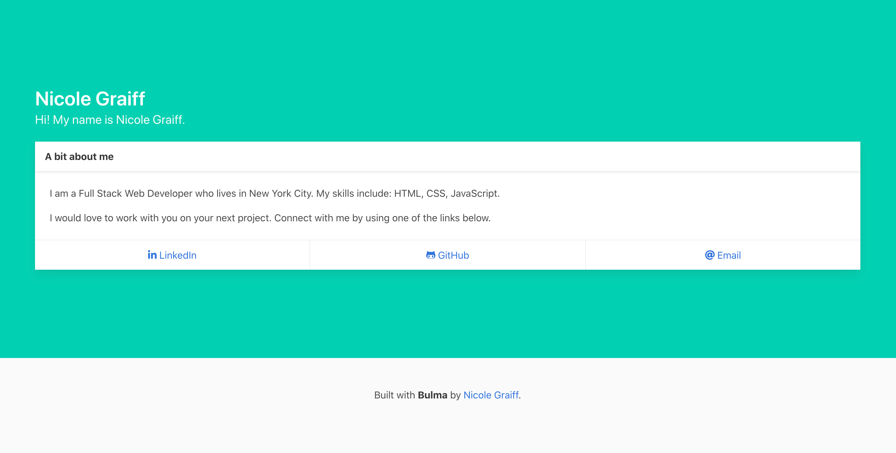
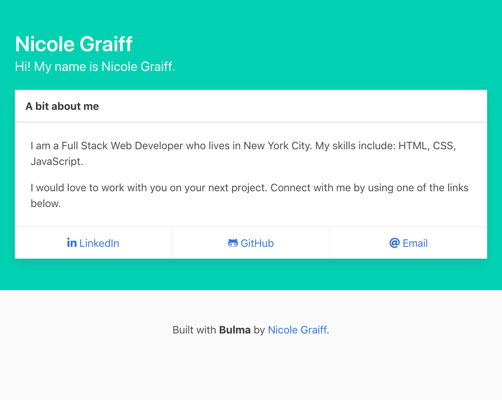

# Bio Page Generator
A command line tool that generates an HTML portfolio page from user input.

## Built With:
1. Node.js
1. [Bulma CSS Framework](https://bulma.io/documentation/overview/start/)
1. [Font Awesome](https://fontawesome.com/)

## Node Dependencies:
1. inquirer
1. util
1. fs

## After cloning the repository:
1. Navigate into your local folder (containing index.js & package.json) in the terminal/bash and enter the following in the command line: 
```javascript
npm install
``` 
2. After installing the dependencies, run the program from the command line by entering:
```javascript
node index.js
```
3. After responding to the prompts, an index.html page will be automatically generated and saved to your folder.

## Generated Bio Page Examples

### Desktop



### Tablet



### Mobile


